# DOOD. — Frontend Flow Summary

> **DOOD.** is an on-demand mechanic service app (car & bike). This document outlines every screen, its purpose, and how users navigate through the app.

---

## Tech Stack

| Layer | Technology |
|-------|-----------|
| Framework | Next.js 16 (App Router) |
| Language | TypeScript |
| Styling | Tailwind CSS v4 |
| Animations | Framer Motion |
| Theme | `#0A0A0A` (black), `#D2FF1D` (neon yellow), `#FFFFFF` (white) |

---

## App Flow

```mermaid
graph TD
    A["/ — Splash Screen"] --> B["/login — Login"]
    B --> C["/main — Home Dashboard"]
    B --> D["/register — Sign Up"]
    D --> C
    C --> E["/radar — Finding Mechanic"]
    E --> F["/mech — Mechanic Tracking"]
```

---

## Screen-by-Screen Breakdown

### 1. `/` — Splash Screen
**Purpose:** Brand intro, first impression.

- Displays the **DOOD.** logo (white text + yellow dot) centered on a black background.
- Logo fades in, holds, then zooms out dramatically.
- Subtle pulsing circle ring in the background.
- **Auto-redirects to `/login`** after ~2.8 seconds.
- No user interaction required.

---

### 2. `/login` — Login Page
**Purpose:** Authenticate existing users via phone number + OTP.

**Step 1 — Phone Input:**
- Country code prefix (`+91`) fixed on the left.
- 10-digit phone number input with digit-only validation.
- "Continue" button sends OTP (simulated 1.2s delay).
- Error states for invalid numbers.

**Step 2 — OTP Verification:**
- 6-digit OTP input boxes with auto-focus and auto-advance.
- Backspace navigates to previous box.
- "Verify & Login" validates and redirects to `/main`.
- "Change number" returns to Step 1.
- "Resend OTP" resets the inputs.

**Navigation:**
- "Don't have an account?" links to `/register`.
- Terms of Service & Privacy Policy links in footer.

---

### 3. `/register` — Sign Up Page
**Purpose:** Register new users with name, phone, and OTP verification.

**Step 1 — User Info:**
- Full name text input.
- Phone number input (same +91 prefix style as login).
- Progress bar showing Step 1 of 2 (yellow fill).
- "Get OTP" button triggers simulated OTP send.

**Step 2 — OTP Verification:**
- Identical 6-digit OTP flow as the login page.
- Progress bar updates to show Step 2 complete.
- "Verify & Create Account" redirects to `/main`.

**Navigation:**
- "Already have an account?" links to `/login`.

---

### 4. `/main` — Home Dashboard
**Purpose:** Central hub — browse services, view offers, navigate the app.

**Header Section (off-white, rounded bottom corners):**
- Location display ("New Delhi, India") with dropdown chevron.
- Notification bell (yellow circle) with red badge dot.
- Search bar with filter button.
- Abstract decorative elements: diagonal lines, circle outlines, subtle yellow glow.

**Special Offers Carousel:**
- 3 offer cards that auto-cycle every 4 seconds.
- Each card: tag, title, discount highlight, description, CTA button.
- Dot indicators below (active dot = expanded yellow bar).
- Swipeable with scroll-snap.

**Services Section:**
- **Car / Bike tab switcher** with animated sliding indicator.
- 3×2 grid of service icons per tab:
  - **Car:** General Service, Tyre & Wheel, Oil Change, Car Wash, Dent Repair, Painting.
  - **Bike:** General Service, Tyre Change, Oil Change, Wash & Clean, Battery, Electricals.
- **Clicking any service navigates to `/radar`.**

**Placeholder Section:**
- Dashed border area reserved for future sections (e.g., Service Providers, Featured Mechanics).

**Bottom Navigation (fixed):**
- 3 tabs: **Home**, **Discover**, **Profile**.
- Active tab has a yellow indicator bar and yellow icon/text.

---

### 5. `/radar` — Finding a Mechanic
**Purpose:** Animated scanning screen that simulates finding a nearby mechanic.

**Visual Elements:**
- 4 concentric rings (scale-in animation).
- Cross-hair lines through the center.
- **Rotating radar sweep** (conic gradient, 2.5s per rotation).
- 5 mechanic blips that appear at staggered times with pulsing ping rings.
- Center user dot with breathing glow animation.

**Status Text (changes over time):**
1. "Scanning nearby…" (0s)
2. "Detecting mechanics in your area…" (2s)
3. "Mechanic found nearby!" (4.2s)

**Auto-redirects to `/mech`** after ~5.5 seconds.

---

### 6. `/mech` — Mechanic Tracking
**Purpose:** Real-time tracking of the assigned mechanic (Uber/Rapido style).

**Map Area (top 44% of screen):**
- Dark abstract map with grid pattern, road lines, and building block shapes.
- **Animated dashed route line** from mechanic marker to user marker.
- Mechanic marker (🔧) with pulsing ring — positioned along the route.
- User marker (📍) with breathing glow — at center.
- Floating **ETA badge** ("8 min away") with a pulsing green dot.
- Back button (top-left) to return to previous screen.

**Bottom Sheet:**
- **Progress tracker:** Confirmed → On the way → Arriving → Servicing (yellow = completed steps).
- **Mechanic card:**
  - Avatar with initials, name, specialty, star rating, review count, experience.
  - Chat button (outline) and Call button (solid yellow).
- **Info cards (2-column grid):**
  - Vehicle details (type + plate number).
  - Distance + ETA.
- **OTP Pin display:** 4-digit code (4729) — share with mechanic to start service.
- **Cancel Service** button (red outline) at the bottom.

---

## Design Principles

| Principle | Implementation |
|-----------|---------------|
| **Mobile-first** | Layout constrained to `max-w-md` (448px), centered on desktop with black side margins |
| **Dark theme** | `#0A0A0A` base, `#141414` cards, `#1C1C1E` elevated surfaces |
| **Brand accent** | Neon yellow `#D2FF1D` for CTAs, active states, highlights |
| **Micro-animations** | Framer Motion throughout — entrance fades, tab transitions, hover/tap feedback, scroll reveals |
| **No placeholders** | All UI elements are functional stubs with mock data, not lorem ipsum |

---

## Route Table

| Route | File | Type | Redirects To |
|-------|------|------|-------------|
| `/` | `app/page.tsx` | Splash | `/login` (auto, 2.8s) |
| `/login` | `app/login/page.tsx` | Auth | `/main` (on verify) |
| `/register` | `app/register/page.tsx` | Auth | `/main` (on verify) |
| `/main` | `app/main/page.tsx` | Dashboard | `/radar` (on service tap) |
| `/radar` | `app/radar/page.tsx` | Animation | `/mech` (auto, 5.5s) |
| `/mech` | `app/mech/page.tsx` | Tracking | — |
